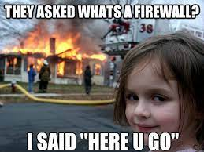
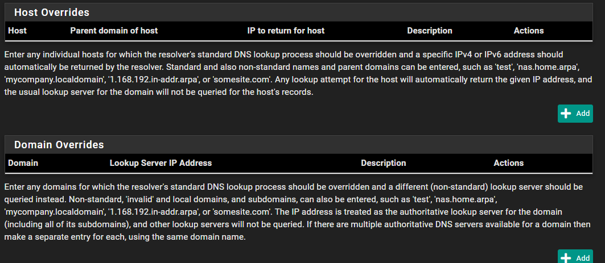

# pfSense Training

## **Welcome** to Burke's Wonderful World of PfSense!



You can access the training range at https://badgerwall.burketech.us/

## Ground Rules

> **DON'T BREAK THE TRAINING ENVIRONMENT**

If you make changes to certain elements you will __**BREAK EVERYONE'S ACCESS**__

## Training Objectives

1. Understand what pfSense is and what role it fills
2. Understand the basics of a Firewall and Firewall rules
3. Understand the basics of DNS and its DNS Resolver
4. Understand the basics VLANs and how to configure them
5. Understand the very basics of routers/routing

## What is pfSense?

According to pfSense website:

> "The pfSense project is a free network firewall distribution, based on the FreeBSD operating system with a custom kernel and including third party free software packages for additional functionality. pfSense software, with the help of the package system, is able to provide the same functionality or more of common commercial firewalls, without any of the artificial limitations..."

> pfSense software includes a web interface for the configuration of all included components. There is no need for any LINUX knowledge, little need to use the command line for anything, and no need to ever manually edit any rule sets. Users familiar with commercial firewalls catch on to the web interface quickly, though there can be a learning curve for users not familiar with commercial-grade firewalls.

In short pfSense is a Firewall/Router/DNS combo. A short baseline for each of these is laid out below.

We'll touch on the following:

1. Terminology
2. Firewalls
    - Interfaces
    - Aliases
3. DNS Resolver
4. VLANs
5. Routing/Routers

[Learn more at pfSense official documentation!](https://docs.netgate.com/pfsense/en/latest/)

## Terminology

- **Interface:** this is a physical or logical connection or port. On a switch, the ports are called "**interfaces**"
- **VLANS:** this is Virtual Local Area Network(s).
    
> VLANs work by applying tags to network frames and handling these tags in networking systems – creating the appearance and functionality of network traffic that is physically on a single network but acts as if it is split between separate networks. In this way, VLANs can keep network applications separate despite being connected to the same physical network, and without requiring multiple sets of cabling and networking devices to be deployed.
- **Alias(es):** this is a grouping of IPs, PORTS, or URLs that can be substituted for those items

## Routers/Routing


You already know what this is! You have one at home most likely, which you've heard called a modem or router. In reality it's probably a Modem **and** Router combo! We won't talk about modems, but a router in concept is simple: route traffic from point A to point B and handle all the questions that come up like "*Where exactly IS point B?*". pfSense can also act as a router, building an understanding of what is where on your network and then forwarding traffic to the correct destinations.

## Firewalls


A **FIREWALL** is something that controls traffic *TO* a given network. It does this with simple/complex rules system. *Allow* this traffic and *deny* that traffic. Rules typically looks like this in raw form:

```EXAMPLE
TO              ACTION       FROM
-----------------------------------------
172.168.5.3/22  DENY         ANYWHERE
172.168.5.24    DENY         172.168.5.23
172.168.5.1     ALLOW        ANYWHERE
```


In the first example, we're saying to deny access (don't send packets) to the IP of 172.168.5.3 on port 22 from ANYWHERE (any IP address). Its important to understand that Firewalls don't typically stop traffic from getting **out** of your network or subdomain, but normally from getting **in**.

Three key concepts to understand with Firewalls:
1. Allow lets traffic (packets) pass to specified destination
2. Deny actually drops and destroys traffic (packets) that evaluate to true like the first and second example above
3. A **FIREWALL** doesn't ROUTE traffic. It isn't responsible for forwarding or sending packets to their desired endpoint, they simply evaluate if any rules are being broken and punishes the offending packets by destorying them (dropping them).

### [Aliases](https://docs.netgate.com/pfsense/en/latest/firewall/aliases.html)

Aliases (Firewall->Aliases) are what they sound like: a reference to a group or individual set. In this case, aliases refer to a group IPs, Ports, or URLs. The `alias` is helpful for dynamic configuration of firewall rules.

An example is configuring your internal network IP space. You could have an alias called `INTERNAL_WORKERS` and then assign a subnet or static IPs to that alias, and then give that alias access via the Firewall. That way if computers come or go it will dynamically change the access. Its like a user group and application access: if you give a group access, then all you need to worry about is the members of the group!


## [DNS and DNS Resolver](https://docs.netgate.com/pfsense/en/latest/services/dns/resolver.html)

The Domain Name System (DNS) is a hierarchical and distributed naming system for computers, services, and other resources in the Internet or other Internet Protocol networks. It associates various information with domain names assigned to each of the associated entities. An example is `8.8.8.8 == www.google.com`

The DNS Resolver takes a human readable name, and converts that to an IP Address. This is useful because you can resolve an IP ADDRESS by referencing the HOSTNAME (e.g., `switch.burketech.us` could be used by my laptop with `ssh attacker@switch.burketech.us`)



### [VLANS](https://docs.netgate.com/pfsense/en/latest/vlan/index.html)

VLANs enable a switch to carry multiple discrete broadcast domains, allowing a single switch to function as if it were multiple switches. VLANs are commonly used for network segmentation in the same way that multiple switches can be used: To place hosts on a specific segment, isolated from other segments. Where trunking is employed between switches, devices on the same segment need not reside on the same switch. Devices that support trunking can also communicate on multiple VLANs through a single physical port.

You reach VLANs in pfSense navigating to `Interfaces/Assignments/VLANs`

Give example here on steps to change interface IP and VLAN tag as well

## Closing Remarks


